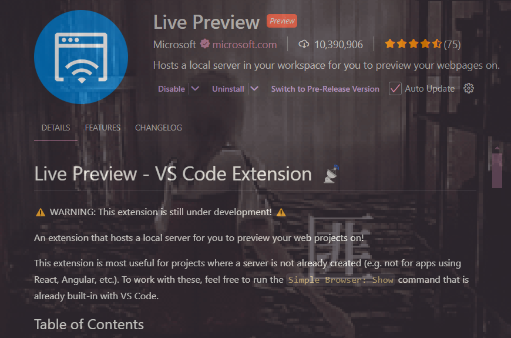

# **Blog Article page**
This is a collaboration to create a *blog/article* webpage

  
THE FOUNDATIONS

   
  <ul>
    Built with: 
    <li>HTML</li>
    <li>CSS</li>
    <li>JS</li>
  </ul>
   

 

  
LIVE PREVIEW STEPS

   
  <ol>
    <!--1.-->
     
    <li>
    Have
    <a href="https://code.visualstudio.com/download">
    Visual Studio Code
    </a>
    (VSCode) installed
    </li>
    <!--2.-->
     
    <li>Have
    <a href="https://desktop.github.com/download/">
    GitHub Desktop
    </a>
    installed
    <ul>
      <li>fork this repository (ps. keep branch name as main)</li>
      <li>open in VSCode</li>
    </ul>
    </li>
    <!--3-->
     
    <li>To access a preview of the blog, download extension 
    <a href="https://marketplace.visualstudio.com/items?itemName=ms-vscode.live-server"
    >
    Live Preview
    </a>
    in VSCode: 
    <ul>
      <li>as long you have this extension downloaded and the code, you can access the local server while editing </li>
      <li>
      <a href="http://127.0.0.1:3000/index.html?serverWindowId=27cd3fdf-85e0-421b-bb9b-9ecca282bd2f" title="http://127.0.0.1:3000/index.html?serverWindowId=27cd3fdf-85e0-421b-bb9b-9ecca282bd2f">
      Preview Page
      </a>
      </li>
    </ul>
     
    

      
    

    </li>
    <!--4-->
     
    <li> </li>
    <li> </li>
    <li> </li>
  </ol>

